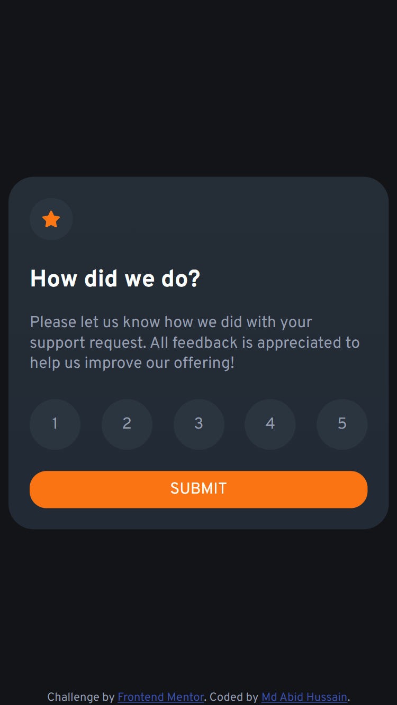
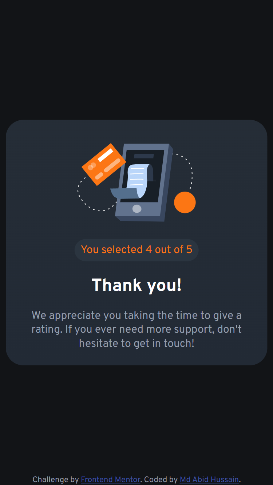

# Frontend Mentor - Interactive rating component solution

This is a solution to the [Interactive rating component challenge on Frontend Mentor](https://www.frontendmentor.io/challenges/interactive-rating-component-koxpeBUmI). Frontend Mentor challenges help you improve your coding skills by building realistic projects. 

## Table of contents

- [Frontend Mentor - Interactive rating component solution](#frontend-mentor---interactive-rating-component-solution)
  - [Table of contents](#table-of-contents)
  - [Overview](#overview)
    - [The challenge](#the-challenge)
    - [Screenshot](#screenshot)
      - [Desktop Design](#desktop-design)
      - [Mobile Design](#mobile-design)
    - [Links](#links)
  - [My process](#my-process)
    - [Built with](#built-with)
    - [What I learned](#what-i-learned)
    - [Continued development](#continued-development)
    - [Useful resources](#useful-resources)
  - [Author](#author)

## Overview

### The challenge

Users should be able to:

- View the optimal layout for the app depending on their device's screen size
- See hover states for all interactive elements on the page
- Select and submit a number rating
- See the "Thank you" card state after submitting a rating

### Screenshot

#### Desktop Design
- Normal State
.png)
- Selected State
.png)
- Submitted State
.png)

#### Mobile Design
- Normal State

- Submitted State

### Links

- Solution URL: [Code](https://github.com/md-abid-hussain/interactive-rating-component)
- Live Site URL: [Site](https://md-abid-hussain.github.io/interactive-rating-component/)

## My process

### Built with

- Semantic HTML5 markup
- CSS custom properties
- Flexbox
- CSS Grid
- Mobile-first workflow
- Vanilla Javascript

### What I learned
Learned DOM, DOM manipulation, Event handling, CSS variables

### Continued development

I want to improve my CSS skill to write more organized code. Also i started learning TailwindCSS which is one of the CSS framework.
I want to improve my javascript knowledge as well

### Useful resources

- [Dave Gray](https://www.youtube.com/@DaveGrayTeachesCode) - Whatever i know in frontend development i've learned from him. He is a great teacher as well as mentor.

## Author

- Website - [Md Abid Hussain](https://www.frontendmentor.io/profile/md-abid-hussain)
- Frontend Mentor - [@md-abid-hussain](https://www.frontendmentor.io/profile/md-abid-hussain)
- Twitter - [@Abid1733](https://twitter.com/Abid1733)
